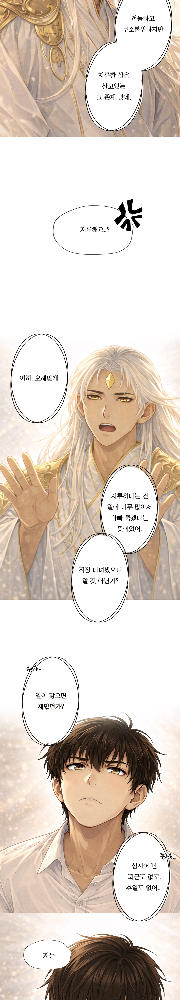

# 이세계 탐정 : 팬미팅 살인사건 GitHub Pages

## 파일 구성

- `index.html`: QR로 들어왔을 때 보이는 첫 메뉴 화면
- `webtoon.html`: 세계관 웹툰 감상 페이지
- `styles.css`: 모바일 중심 레이아웃과 웹툰 이미지 표시 스타일
- `assets/webtoon/`: 웹툰 이미지 파일을 넣는 폴더

## 웹툰 이미지 넣는 법

1. 저장소 안에 `assets/webtoon` 폴더를 만듭니다.
2. 웹툰 컷 이미지를 아래 이름으로 넣습니다.
   - `episode-01-001.jpg`
   - `episode-01-002.jpg`
   - `episode-01-003.jpg`
3. 이미지가 더 많으면 `webtoon.html`에 `` 줄을 추가합니다.

```html

```

## 권장 웹툰 이미지 사이즈

- 모바일 세로 스크롤 웹툰이면 가로 `720px` 또는 `1080px`를 추천합니다.
- GitHub Pages 트래픽과 휴대폰 로딩을 생각하면 `720px` 폭이 가장 무난합니다.
- 한 장의 세로 길이는 너무 길게 만들기보다 `3000px`에서 `6000px` 정도로 잘라 여러 장으로 나누는 편이 안정적입니다.
- 파일 형식은 사진/그림 복합이면 `.jpg`, 텍스트와 선이 많은 이미지면 `.webp` 또는 `.png`를 추천합니다.
